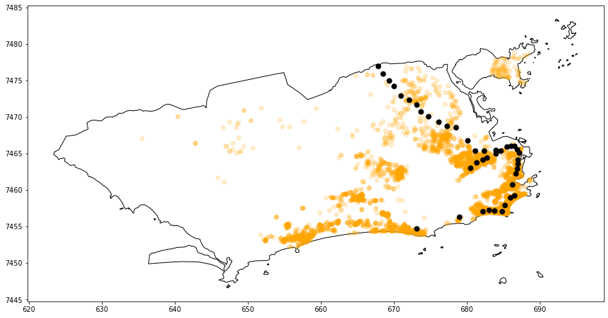

<!DOCTYPE html>
<html>
<head>
<meta charset="UTF-8"/>
<h1>Urban planning and spatial analysis</h1>
</head>
<body>
<!-- Conteúdo -->
  
Urban planning and spatial analysis

  

  <h3>Analysis and visualization of spatial data from OpenStreetMap</h3>
  

    <a href="https://github.com/renatogcruz/urban-planning-and-spatial-analysis/tree/main/osmnx-examples">OSMnx Library</a>
  

  
OSMnx: Python for street networks. Retrieve, model, analyze, and visualize street networks and other spatial data from OpenStreetMap.

  
Links

  

  <a href="https://github.com/gboeing/osmnx">repository</a>
  

  

  <a href="https://geoffboeing.com/">blog</a>
  

  
  <h3>Geopandas</h3>  
  

  GeoPandas is an open source project to make working with geospatial data in python easier. 
  

  

  Rio de Janeiro city map containing properties for sale (in orange) and subway stations (in black). The greater the distance between a property and a subway station, the lower the value of that property.
  

      
  
  
  <h3>openstreetmap machine learning</h3>
  

  [...]
  

  
  <h3>Spring</h3>  
  

  <a href="http://www.dpi.inpe.br/spring/portugues/manuais.html">Curso de Geoestatística com laboratórios no SPRING</a> 
  

  

  <a href="http://www.dpi.inpe.br/spring/portugues/manuais.html">Aplicação Python para Análise Exploratória, Modelagem de Semivariograma e Predições</a>
  

  
  

  [...]
  

  
  
https://github.com/varsha2509/hyperlocal-aq-prediction

  
https://ichi.pro/pt/implantando-seus-projetos-de-aprendizado-de-maquina-geoespacial-como-aplicativos-da-web-usando-streamlit-e-heroku-76786757885104

  
  
https://www.youtube.com/c/QiushengWu/playlists

  
  <h3>Qgis</h3>  
  

  Qgis - A Free and Open Source Geographic Information System. 
  

  

  <a href="https://www.youtube.com/watch?v=MyHi6M9IVpA">OpenStreetMap to production-ready map</a>
  

  

  <a href="https://www.youtube.com/watch?v=Yxkh2f-3Bj8">Extraindo dados do OpenStreetMap usando QGIS e QuickOSM</a>
  

  
</body>
</html>

